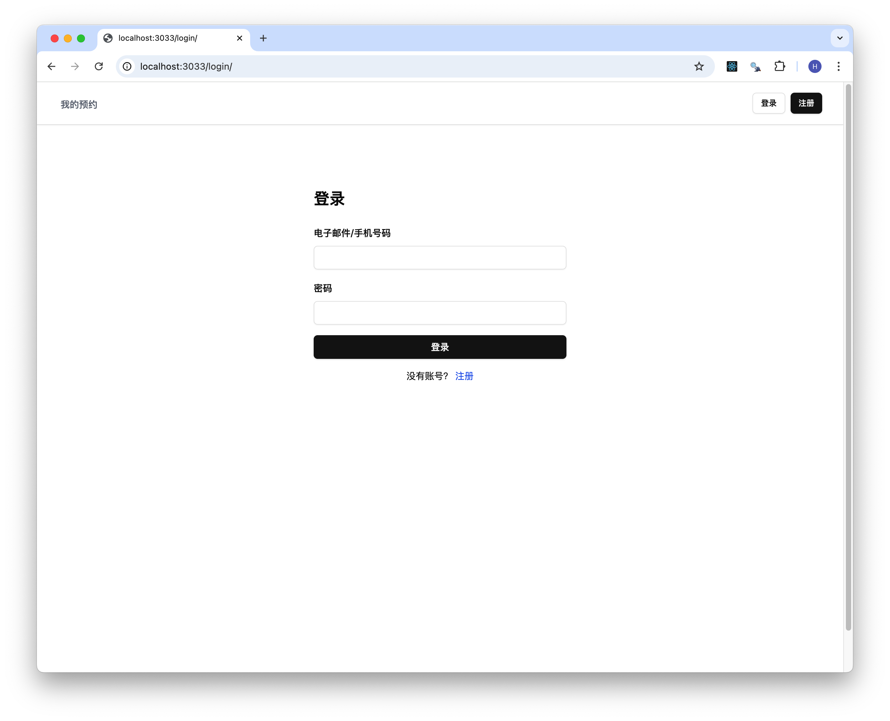
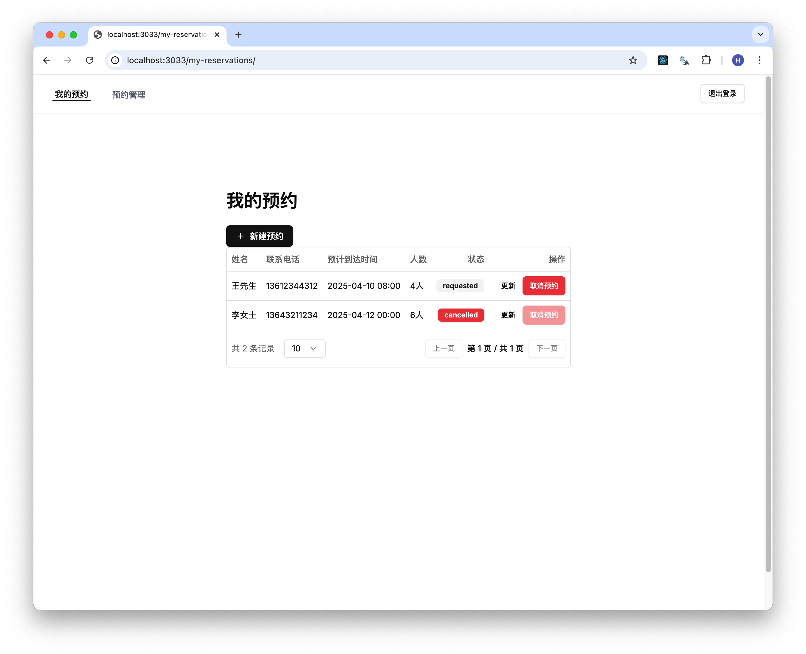
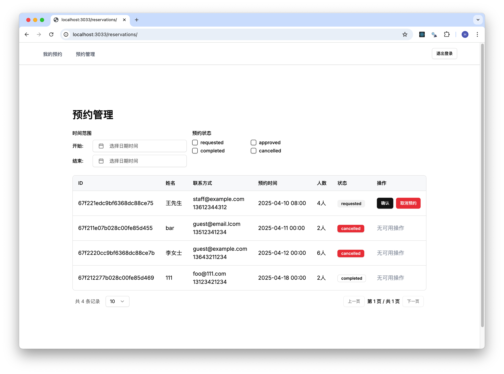

# mvp-restaurant-booking

## 项目介绍

某餐厅在线预订系统，可以让顾客方便地预订座位。顾客可以通过提供个人联系方式来完成预订，餐厅员工则可以高效地查看和管理这些预订信息。

## 系统架构

### 系统整体介绍

系统分为前端与后端两个项目，前端使用 React，后端使用 Express.js，数据库使用 MongoDB。

1. server：后端项目，使用 Node.js 框架，提供 RESTful 与 GraphQL 接口，处理业务逻辑，与数据库交互。
2. web: 前端项目，SPA，使用 React 框架，提供用户界面，与后端接口交互。

后端项目详情请参见 [后端项目说明](./apps/server/README.md)。
前端项目详情请参见 [前端项目说明](./apps/web/README.md)。

## 组织结构

```
project
├── apps -- 项目目录
|   ├── server -- 后端应用
|   └── web -- 前端应用
├── docs -- 项目文档说明集合
|   ├── images -- 这里面存放用于本文档的引用的图片
|   ├── arch.mmd -- 整体架构图
|   ├── event-storming.puml -- 事件风暴图
|   └── lib-eventstorming.puml -- 事件风暴库
|── .gitignore -- 事件风暴库
|── mvp-restaurant-booking.code-workspace -- vscode 工作区配置文件
|── package-lock.json -- 包依赖锁文件
|── package.json -- 项目配置文件
└── README.md -- 项目说明文档
```

## 技术概要

详情查看具体 app 的 README.md 文件。

前端：

- Next.js SPA
- Shadcn UI
- GraphQL Apollo Client

后端：

- Express.js
- MongoDB
- GraphQL Apollo Server
- JWT
- migrate-mongo
- TDD/Mocha/Chai/Sinon/supertest

工程：

- Docker
- Docker Compose
- Git Hook
- Husky
- Eslint
- Prettier

## 后端代码覆盖率报告

```
=============================== Coverage summary ===============================
Statements   : 98.28% ( 688/700 )
Branches     : 93.25% ( 83/89 )
Functions    : 92.85% ( 26/28 )
Lines        : 98.28% ( 688/700 )
================================================================================
```

2025-04-06 21:20 由 c8 生成。

## 本地运行搭建

### 环境依赖

| 工具   | 版本号 | 下载                                            |
| ------ | ------ | ----------------------------------------------- |
| Docker | 27.4.0 | https://docs.docker.com/get-started/get-docker/ |

### 使用 docker compose 快速启动

请确保已经安装 Docker，然后在当前目录执行以下命令启动项目：

```bash
sh quick_start.sh
```

浏览器地址栏输入 http://localhost:3033/login/ 访问网站。

使用以下测试账号进行登录：

| email             | 手机号      | 密码     |
| ----------------- | ----------- | -------- |
| staff@example.com | 13912341234 | 12345678 |
| guest@example.com | 13612341234 | 12345678 |

guest 账号无法访问预约管理页面。

## 网页截图





Copyright (c) 2022 Huhinka
