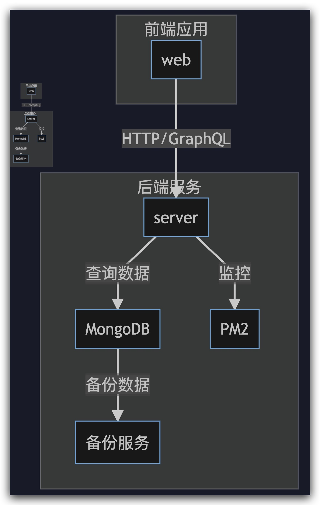

# mvp-restaurant-booking

## 项目介绍

某餐厅在线预订系统，可以让顾客方便地预订座位。顾客可以通过提供个人联系方式来完成预订，餐厅员工则可以高效地查看和管理这些预订信息。

## 应用功能

- [x] 用户登录、注册
- [x] 客人预约餐厅
- [x] 客人更新预约
- [x] 客人取消预约
- [x] 客人查看预约情况
- [x] 餐厅员工查看预约情况
- [x] 餐厅员工批准预约
- [x] 餐厅员工取消预约
- [x] 餐厅员工完成预约
- [ ] Swagger API Doc
- [x] docker compose
- [ ] metrics
- [ ] Solidjs SPA

## 系统架构



### 系统整体介绍

系统分为前端与后端两个项目，前端使用 React，后端使用 Express.js，数据库使用 MongoDB。

1. server：后端项目，使用 Node.js 框架，提供 RESTful 与 GraphQL 接口，处理业务逻辑，与数据库交互。
2. web: 前端项目，SPA，使用 React 框架，提供用户界面，与后端接口交互。

后端项目说明请参见 [后端项目说明](./apps/server/README.md)。

## 组织结构

```
project
├── apps -- 项目目录
|   ├── server -- 后端应用
|   └── web -- 前端应用
├── docs -- 项目文档说明集合
|   ├── images -- 这里面存放用于本文档的引用的图片
|   ├── arch.mmd -- 整体架构图
|   ├── event-storming.puml -- 事件风暴图
|   └── lib-eventstorming.puml -- 事件风暴库
|── .gitignore -- 事件风暴库
|── mvp-restaurant-booking.code-workspace -- vscode 工作区配置文件
|── package-lock.json -- 包依赖锁文件
|── package.json -- 项目配置文件
└── README.md -- 项目说明文档
```

## 技术概要

| 技术       | 说明             | 官网                  |
| ---------- | ---------------- | --------------------- |
| Node.js    | JS 运行时        | https://nodejs.org/en |
| Express.js | Node.js web 框架 | https://expressjs.com |

## 环境搭建

### 开发环境

| 工具   | 版本号 | 下载                                            |
| ------ | ------ | ----------------------------------------------- |
| Docker | 27.4.0 | https://docs.docker.com/get-started/get-docker/ |

#### docker compose 快速启动

```bash
docker compose up
```

TODO 访问 http://localhost:3033 查看效果

Copyright (c) 2022 Huhinka
