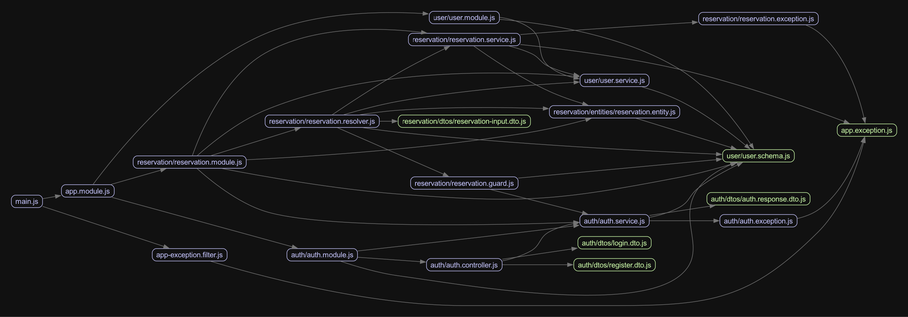

# mvp-restaurant-booking server-nestjs

## 项目介绍

某餐厅预约系统后端。

与 server 项目功能一致，但使用 nestjs 框架重写。

特点：

- TypeScript
- Nest.js
- Code first GraphQL

## 组织结构

```
server
├── migrations -- 数据库迁移脚本
|   ├── 20250404044758-create_user_index.js -- 创建用户索引
├── src -- 源代码
|   ├── auth -- 认证鉴权相关模块
|   ├── reservation -- 预约相关模块
|   ├── user -- 用户相关模块
|   ├── app.module.js -- 应用模块定义
|   └── main.js -- 入口
├── test -- 测试代码
|   ├── e2e -- 端到端测试
|   ├── integration -- 集成测试
├── .env.example -- 环境变量示例
├── Dockerfile -- Docker 镜像构建
├── eslint.config.mjs -- eslint 配置
├── package.json -- 项目配置
└── README.md -- 项目说明
```

## 模块依赖关系



## 技术概要

| 技术          | 说明                                | 官网                                             |
| ------------- | ----------------------------------- | ------------------------------------------------ |
| Node.js       | JS 运行时                           | https://nodejs.org/en                            |
| TypeScript    | 类型安全的 JavaScript 超集          | https://www.google.com/search?q=typescript       |
| Nest.js       | Node.js web 框架                    | https://docs.nestjs.com                          |
| Docker        | 虚拟化应用容器引擎                  | https://www.docker.com                           |
| GraphQL       | 可以精确返回指定字段的 API 查询语言 | https://expressjs.com                            |
| Apollo Server | 开源的，符合规范的 GraphQL 服务器   | https://www.apollographql.com/docs/apollo-server |
| Mongoose ORM  | 优雅的 MongoDB 对象建模             | https://mongoosejs.com                           |

## 环境搭建

### 开发环境

| 工具    | 版本号  | 下载                                           |
| ------- | ------- | ---------------------------------------------- |
| Node.js | 20.19.0 | https://nodejs.org/en/download                 |
| MongoDB | 4.4.5   | https://www.mongodb.com/try/download/community |

### 开发配置

1. 拷贝 `.env.example` 文件为 `.env` 文件，并修改其中的配置项。主要修改数据库连接信息。

### 运行步骤

运行开发环境：

```bash
npm install
npm run start:dev
```

运行单元测试、覆盖率报告与集成测试：

```bash
npm run test
npm run test:cov
npm run test:integration
```

## 项目构建

### 构建 Docker 镜像

在当前目录下运行以下命令构建镜像：

```bash
docker build -t mvp-restaurant-booking-server-nestjs --build-context proj-root=../.. .
```

项目依赖 MongoDB，请参考 [Docker Compose 项目构建说明](../../README.md) 运行完整的应用。

Copyright (c) 2022 Huhinka
