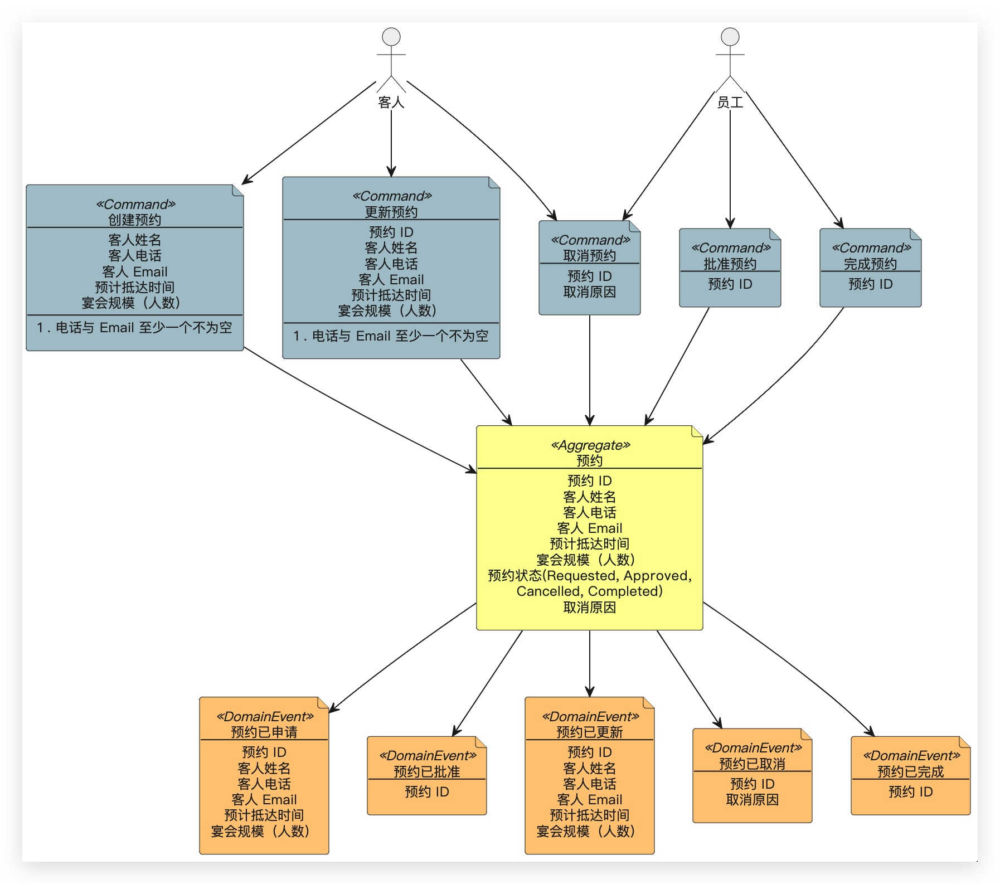

# mvp-restaurant-booking server

## 项目介绍

某餐厅预约系统后端。

## 系统架构

### 系统整体介绍

该系统是一个基于 Node.js 和 Express.js 的后端系统，用于处理餐厅预约相关的业务逻辑。系统采用 GraphQL 作为 API 查询语言，通过 Apollo Server 实现了 GraphQL 服务器。系统使用 Mongoose ORM 与 MongoDB 数据库进行交互，实现了用户和预约的增删改查功能。系统还包含了认证鉴权模块，用于保护敏感数据。

## 系统模块

### auth

认证鉴权模块，用于处理用户的注册、登录等操作。该模块包含了用户模型、认证鉴权中间件、认证鉴权路由和用户请求验证器等组件。

### infrastructure

基础设施模块，用于处理系统的底层功能，如数据库连接、错误处理和日志记录等。该模块包含了数据库连接、错误处理器和日志等组件。

### reservation

预约模块，用于处理餐厅预约相关的业务逻辑。该模块包含了预约模型、预约 GraphQL 路由接口、预约 GraphQL 解析器和预约 GraphQL 模式等组件。

## 事件风暴



## 组织结构

```
server
├── src -- 源代码
|   ├── auth -- 认证鉴权相关模块
|   |   ├── auth.middleware.js -- 认证鉴权中间件
|   |   ├── auth.route.js -- 认证鉴权路由
|   |   ├── user.model.js -- 用户模型
|   |   └── validators.js -- 用户请求验证器
|   ├── infrastructure -- 基础设施相关模块
|   |   ├── db.js -- 数据库连接
|   |   ├── error-handler.js -- 错误处理器
|   |   └── logger.js -- 日志
|   ├── reservation -- 预约相关模块
|   |   ├── reservation.graphql.js -- 预约 GraphQL 路由接口
|   |   ├── reservation.model.js -- 预约模型
|   |   ├── reservation.resolver.js -- 预约 GraphQL 解析器
|   |   └── reservation.schema.js -- 预约 GraphQL 模式
|   ├── app.js -- 应用
|   └── server.js -- 应用服务器
├── test -- 测试代码
|   ├── auth -- 认证鉴权测试相关模块
|   |   ├── auth.middleware.test.js -- 认证鉴权中间件测试
|   |   └── auth.route.test.js -- 认证鉴权路由测试
|   ├── reservation -- 预约相关模块
|   |   └── reservation.test.js -- 预约 GraphQL 接口测试
|   └── setup.js -- 测试环境设置
├── .env.example -- 环境变量示例
├── Dockerfile -- Docker 镜像构建
├── eslint.config.mjs -- eslint 配置
├── package.json -- 项目配置
└── README.md -- 项目说明
```

## 技术概要

| 技术          | 说明                                | 官网                                             |
| ------------- | ----------------------------------- | ------------------------------------------------ |
| Node.js       | JS 运行时                           | https://nodejs.org/en                            |
| Express.js    | Node.js web 框架                    | https://expressjs.com                            |
| Docker        | 虚拟化应用容器引擎                  | https://www.docker.com                           |
| GraphQL       | 可以精确返回指定字段的 API 查询语言 | https://expressjs.com                            |
| Apollo Server | 开源的，符合规范的 GraphQL 服务器   | https://www.apollographql.com/docs/apollo-server |
| Mongoose ORM  | 优雅的 MongoDB 对象建模             | https://mongoosejs.com                           |
| mocha         | 功能丰富的 JavaScript 测试框架      | https://mochajs.org                              |
| chai          | BDD/TDD 断言库                      | https://www.chaijs.com                           |
| sinon         | 独立的测试 spies、stubs 与 mocks 库 | https://sinonjs.org                              |

## 环境搭建

### 开发环境

| 工具    | 版本号  | 下载                                           |
| ------- | ------- | ---------------------------------------------- |
| Node.js | 20.19.0 | https://nodejs.org/en/download                 |
| MongoDB | 4.4.5   | https://www.mongodb.com/try/download/community |

### 开发配置

1. 拷贝 `.env.example` 文件为 `.env` 文件，并修改其中的配置项。主要修改数据库连接信息。

### 运行步骤

运行开发环境：

```bash
npm install
npm run dev
```

运行测试与覆盖率报告：

```bash
npm run test
npm run coverage
```

## 项目关键注意点

### 开发注意点

1. ....
2. ....

### 遗留问题

1. ....
2. ....

## 外部项目参考

- 在这里描述用于借鉴的项目

Copyright (c) 2022 Huhinka
